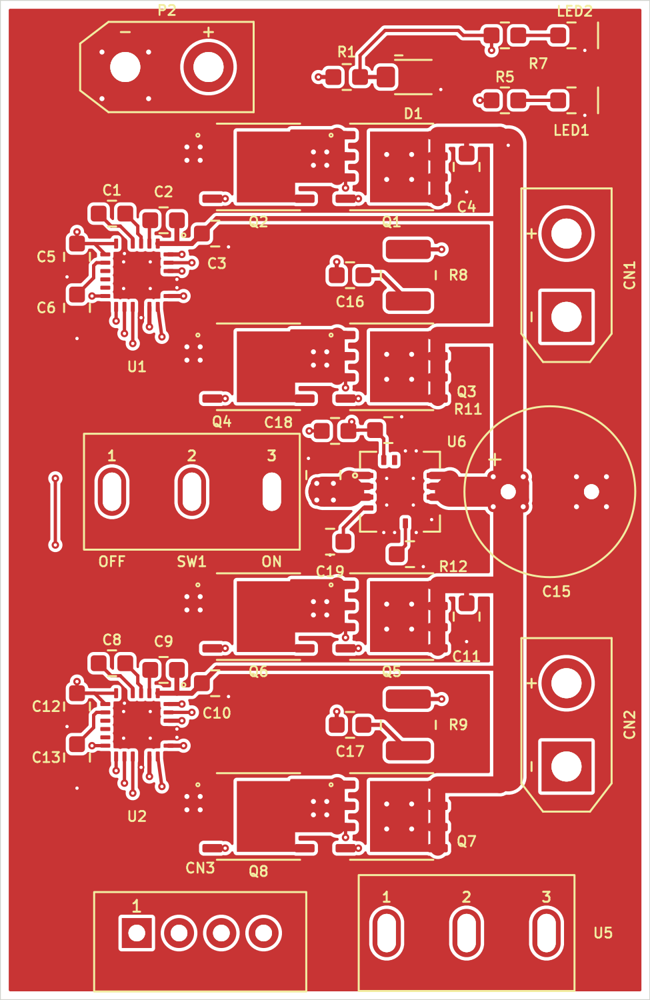

# DRV8701 双电机驱动板

依据原始原理图绘制的 **12 V、48×36 mm、4 层**双电机驱动板，严格保留原图连接与元件值。布局、每段铜线及过孔由人工规划，未使用自动布线或路径搜索。

[网页端 KiCad 导入包](downloads/DRV8701_12V_KiCad5_Import.zip) · [完整资料与源文件 ZIP](downloads/DRV8701_12V_EasyEDA_Pro.zip) · [导入说明](hardware/drv8701-dual-12v/IMPORT_IN_WEB_PRO.md)

## 打开工程

用户当前使用**嘉立创 EDA 专业版网页端**。请下载专用的 **`DRV8701_12V_KiCad5_Import.zip`**，在网页开始页选择 **「导入 KiCad」**并直接选择此 ZIP。按[官网指引](https://prodocs.lceda.cn/cn/import-export/import-kicad/index.html)，支持的旧格式版本列为 KiCad 5.1／5.9；本次导入包采用真实 KiCad 5.1 格式。

工程的原理图、PCB、本地符号与封装库一起打包。布局、元件值、网络和人工布线保留；导入时专业版会重建铺铜，完成后须检查铜区和 DRC。具体导入步骤及转换检查见[网页导入说明](hardware/drv8701-dual-12v/IMPORT_IN_WEB_PRO.md)。

仓库同时保留 KiCad 9 原始源文件及新版桌面 `.eprj3` 文件夹工程。完整资料 ZIP 用于保留这些源文件和报告；网页端导入请使用上面的专用 KiCad 5.1 ZIP。新版桌面文件的打开说明见 [OPEN_IN_PRO.md](hardware/drv8701-dual-12v/EasyEDA_Pro/OPEN_IN_PRO.md)。

## 工程内容

- [网页端 KiCad 5.1 导入工程](hardware/drv8701-dual-12v/KiCad_Import_5/)
- [新版桌面原生工程](hardware/drv8701-dual-12v/EasyEDA_Pro/)
- [可编辑 KiCad 工程及自带库](hardware/drv8701-dual-12v/)
- [原理图 PDF](hardware/drv8701-dual-12v/DRV8701_DUAL_12V_schematic.pdf) 与 [PCB 各层检查图](hardware/drv8701-dual-12v/PCB_layers_review.pdf)
- [元件清单](hardware/drv8701-dual-12v/components.csv) 与 [采购约束](hardware/drv8701-dual-12v/procurement_notes.csv)
- [最终检查记录](hardware/drv8701-dual-12v/validation/final_delivery.json)、[独立工程审查](hardware/drv8701-dual-12v/source/engineering_review.md) 与 [原生转换审计](hardware/drv8701-dual-12v/EasyEDA_Pro/native-final-audit.json)

## 检查状态

原始源板 KiCad DRC 为 **0 违规、0 未连接**；原理图 ERC 为 **0 错误、0 警告**。网页导入副本也已通过真实 **KiCad 5.1.9** 检查：ERC **0 错误、0 警告**，PCB DRC **0 错误、0 未连接**；38 个元件及原值、34 个网络、173 个物理引脚全部一致。

原 258 条外部与功率线路、76 个过孔及所有焊盘几何保留。旧版副本另含 32 条位于 MOS 原有 Drain 铜焊盘内的短连接段，用于明确旧版的连通判定；总计 290 条线段。这些短段经独立几何证明，新增实际铜面积为 **0.0 mm²**。详情见[最终兼容检查](hardware/drv8701-dual-12v/validation/legacy5_final_pcb_equivalence.json)。

**尚未在真实嘉立创 EDA 专业版中完成导入或运行其 DRC，也未进行样板通电和温升测试。** 导入后须确认 48×36 mm 尺寸、1.6 mm 板厚、四层各 35 µm 铜、0.15 mm 最小间距以及重新生成的地铜。现已取得并读取 TPH1R403NL 原厂手册，核对了引脚、电气参数与普通 SOP Advance 机械图；手册没有提供推荐 PCB 焊盘图，采购须匹配普通 SOP Advance 封装。详见[原厂资料核对](hardware/drv8701-dual-12v/source/tph1r403nl_manufacturer_review.md)。

原图的 100 nF 充电泵／内部电源去耦、齐纳供电、IDRIVE 配置和无 GND 的控制接口按用户要求保留；问题及验证步骤见工程说明。本仓库的静态检查结果不代表硬件制造放行。

## 来源与许可证

工程内使用的官方开源转换与校验工具保留各自的 Apache-2.0／MIT 许可证；上游地址与精确版本见 [版本记录](hardware/drv8701-dual-12v/tools/easyeda-native/upstream-versions.json)。这些工具的许可证不自动覆盖整块电路设计、第三方封装或所附厂商 PDF。详细原理图、封装和手册来源见工程说明。
